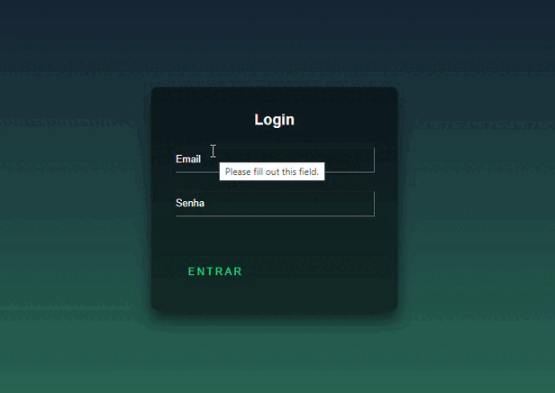

# **Tela de login**

## ``Descrição``
Um formulário de login simples com um design elegante usando HTML e CSS.

## ``Índice``

* [Estrutura do HTML](#estrutura-do-html)
* [Style CSS](#style-css)
* [Preview](#preview)

## ``Estrutura do HTML``

```html

<!-- Código HTML -->

<!DOCTYPE html>
<html>
<head>
    <meta charset='utf-8'>
    <meta http-equiv='X-UA-Compatible' content='IE=edge'>
    <title>Page Title</title>
    <meta name='viewport' content='width=device-width, initial-scale=1'>
    <link rel='stylesheet' type='text/css' media='screen' href='login.css'>
    <script src='main.js'></script>
</head>
<body>

<div class="login">
    <h2>Login</h2>
    <form action="">
        <div class="email">
            <input type="text" required>
            <label for="">Email</label>
        </div>
        <div class="email">
            <input type="senha" required>
            <label for="">Senha</label>
        </div>
        <a href="">
            <span></span>
            <span></span>
            <span></span>
            <span></span>Entrar
        </a>
    </form>
</div>
```


## ``Style CSS``
```html

<!-- Código CSS -->

html{
  height: 100%;
}

body{
  margin: 0;
  padding: 0;
  font-family: sans-serif;
  background: linear-gradient(#141e30, #2a6c56);
}

.login{
  position: absolute;
  top: 50%;
  left: 50%;
  width: 400px;
  padding: 40px;
  transform: translate(-50%, -50%);
  background: rgba(0, 0, 0, 0.5);
  box-sizing: border-box;
  box-shadow: 0 15px 25px rgba(0, 0, 0, 0.6);
  border-radius: 10px;
}

/* ... (estilos para outros elementos) */
```
## ``Preview``



## ``Estilo e Animações``
**Posicionamento:** O formulário é centralizado na página usando posicionamento absoluto e a propriedade transform.

**Estilo de entrada:** As entradas de e-mail e senha têm fundos transparentes e rótulos animados que se movem para cima quando em foco ou contêm texto.

**Estilo do botão Enviar:** O botão enviar tem um efeito de foco, alterando a cor de fundo e adicionando uma sombra.

**Linhas animadas:** As linhas no botão de envio têm animação dinâmica, criando um efeito visualmente atraente ao passar o mouse.

## ``Créditos``

* Autor: Deivid Lucas 

* Fontes utilizadas: [jogindrakumar](https://github.com/jogindrakumar/create-login-form-with-light-button/blob/main/index.html)